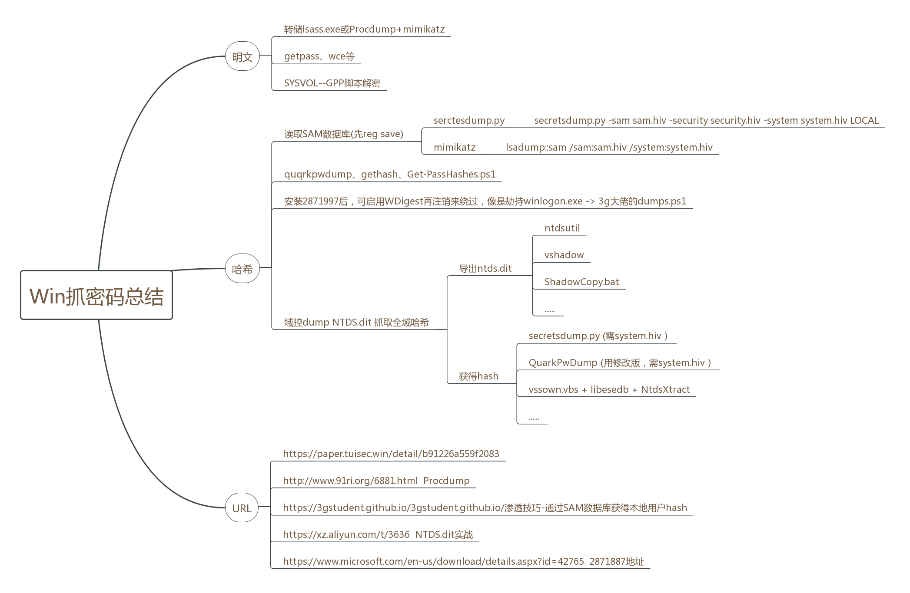
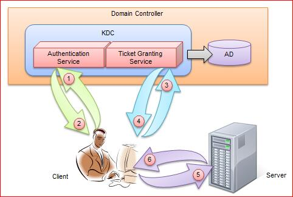
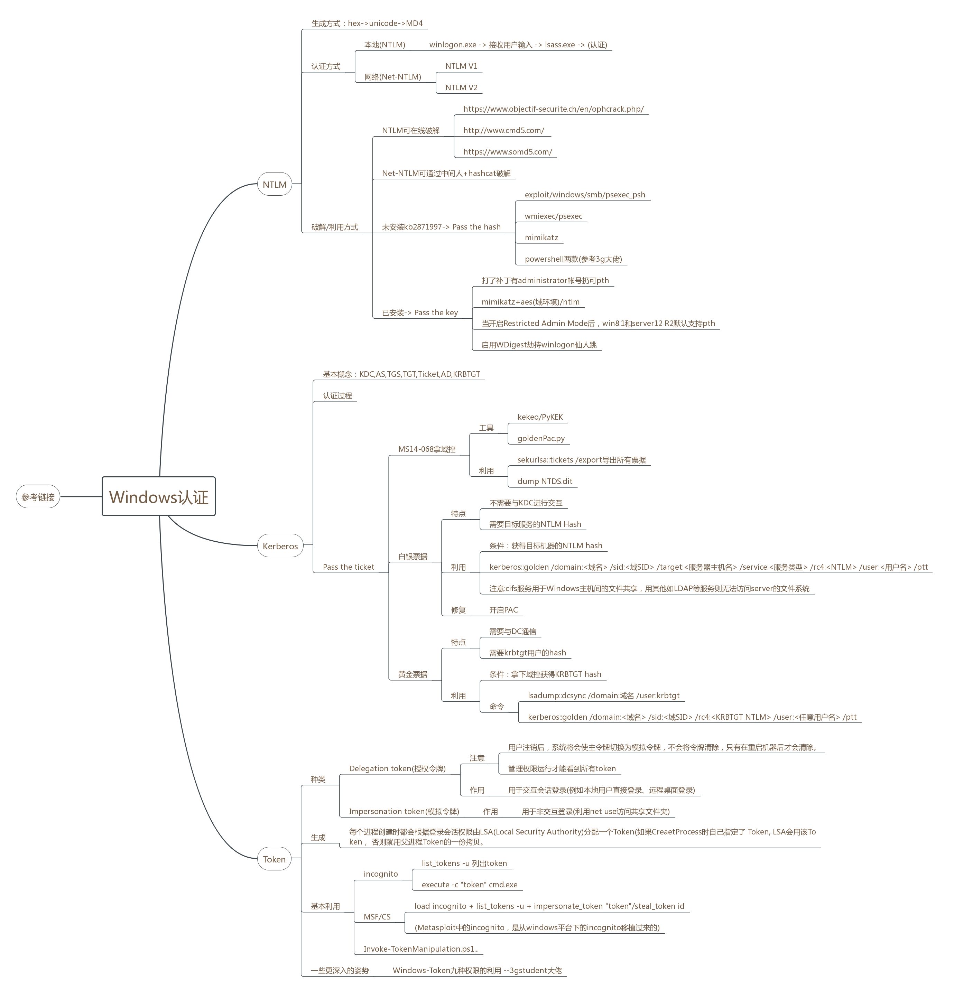

# JSRC安全小课堂 第137期 

本期的主题是:浅谈内网渗透中的Windows认证

本期的讲师是来自ChaMd5安全团队的ShadowGlint，擅长代码审计和渗透测试

---

## 议题一：Windows的认证方式主要有哪些？

**讲师**：
- Windows的认证方式主要有 **NTLM认证**、**Kerberos认证** 两种。同时，**Windows Access Token**记录着某用户的SID、组ID、Session、及权限等信息，也起到了权限认证的作用。

   - 其中，NTLM认证主要有本地认证和网络认证两种方式。本地登录时，用户的密码存储在%SystemRoot%\system32\config\sam这个文件里。当用户输入密码进行本地认证的过程中，所有的操作都是在本地进行的。他其实就是将用户输入的密码转换为NTLM Hash，然后与SAM中的NTLM Hash进行比较。而网络认证则是基于一种Challenge/Response认证机制的认证模式。他的认证过程我们下边会详细讲。

   - Kerberos认证用于域环境中，它是一种基于票据（Ticket）的认证方式。他的整个认证过程涉及到三方：客户端、服务端和KDC（Key Distribution Center）。在Windows域环境中，由DC(域控)来作为KDC。

   - Access Token(访问令牌)是用来描述进程或线程安全上下文的对象，令牌所包含的信息是与该用户账户相关的进程或线程的身份和权限信息。当用户登陆时，系统生成一个Access Token，然后以该用户身份运行的的所有进程都拥有该令牌的一个拷贝。这也就解释了A用户创建一个进程而B用户没有该进程的权限。

#### 提问环节

**路人甲**：

> Kerberos认证据说有两种，金票和银票？这两种有啥区别吗

**讲师**：

> 白银票据的特点是 不需要与KDC进行交互、需要目标服务的NTLM Hash
> 
> 黄金票据的特点是需要与DC通信、需要krbtgt用户的hash  这个下边会说的

---

###  议题二：NTLM的认证过程是怎样的？

**讲师**：

- 首先是本地认证，也就是NTLM Hash的生成方式。
  - 当用户注销、重启、锁屏后，操作系统会让winlogon显示登录界面，也就是输入框。当winlogon.exe接收输入后，将密码交给LSASS进程，这个进程中会存一份明文密码，将明文密码加密成NTLM Hash，对SAM数据库比较认证。
     > winlogon.exe即Windows Logon Process，是Windows NT用户登陆程序，用于管理用户登录和退出。
    LSASS用于微软Windows系统的安全机制。它用于本地安全和登陆策略。

  - 比如当用户输入密码123456后，那么操作系统会将123456转换为十六进制，经过Unicode转换后，再调用MD4加密算法加密，这个加密结果的十六进制就是NTLM Hash

- 看明白本地认证的过程后，再说一下网络认证的具体过程。NTLM协议的认证共需要三个消息完成：**协商、挑战、认证**。
  - 协商：主要用于确认双方协议版本、加密等级等
  - 挑战：服务器在收到客户端的协商消息之后， 会读取其中的内容，并从中选择出自己所能接受的服务内容，加密等级，安全服务等等。 并生成一个随机数challenge, 然后生成challenge消息返回给客户端。该消息就是挑战/响应认证机制的主要功能体现。
  - 认证：验证主要是在挑战完成后，验证结果，是认证的最后一步。
- 详细过程如下：
  - 第一步,输入密码,然后LSASS会把密码的NTLM Hash后的值先存储到本地。
  - 第二步,客户端把用户名的明文发送给服务端
  - 第三步,服务端会生成一个16位的随机数,即challenge,再传回给客户端
  - 第四步,当客户端收到challenge后,用在第一步中存储的NTLM Hash对其加密，然后再将加密后的challenge发送给服务器，也就是response。
  - 第五步,服务端在收到response后，会向DC发送针对客户端的验证请求。该请求主要包含以下三方面的内容：**客户端用户名、客户端NTLM Hash加密的Challenge、原始的Challenge**。
  - 第六步,当DC接到过来的这三个值的以后,会根据用户名到DC的账号数据库(ntds.dit)里面找到该用户名对应的NTLM Hash,然后把这个hash拿出来和传过来的challenge值进行比较,相同则认证成功,反之,则失败。
- 上边说的是NTLM v1认证方式，NTLM v2和v1最显著的区别就是Challenge与加密算法不同，共同点就是加密的key都是NTLM Hash。NTLM v1的Challenge有8位，NTLM v2的Challenge为16位。NTLM v1的主要加密算法是DES，NTLM v2的主要加密算法是HMAC-MD5。

### 提问环节

**路人甲**：

> NTLM v2爆破难度加大了吧

**讲师**：

> 爆破的话，需要抓取通信数据，用hashcat来爆破
>
> 利用姿势下面也会讲~
>
> 主要分清网络认证和本地认证

---

## 议题三：针对NTLM的姿势主要有哪些？

**讲师**：

- 当我们通过dump hash拿到了NTLM Hash后，我通常首先尝试能不能直接在线破解。常用的破解网站：

  http://www.chamd5.org/

  https://www.objectif-securite.ch/en/ophcrack.php
  
  http://www.cmd5.com/
  
  https://www.somd5.com/

- 如果不能破解，那可以尝试Pass The Hash(hash传递)。
  哈希传递就是使用用户名对应的NTLM Hash将服务器给出的Chanllenge加密，生成一个Response，来完成认证。Pass The Hash能够完成一个不需要输入密码的NTLM协议认证流程，所以不算是一个漏洞，算是一个技巧。

- 常用的pth的工具主要有:mimikatz(首选)、wmiexec/psexec、exploit/windows/smb/psexec_psh、powershell invoke系列小脚本。
- 当然，pth也是有利用条件的。如果目标机器安装了KB2871997，那我们就不能pth了。那我们还有另一个姿势：Pass The Key。

  - 对于8.1/2012r2，安装补丁**kb2871997**的Win 7/2008r2/8/2012，可以使用AES keys代替NTLM Hash。在mimikatz抓hash时可以抓到。其实，mimikatz中的pth本身就是ptk了。
- 除这些外，还有很多其他姿势，比如打了补丁有administrator帐号扔可pth、当开启Restricted Admin Mode后，win8.1和server12 R2默认支持pth、启用WDigest劫持winlogon仙人跳等。

     > winlogon仙人跳 就是先锁屏，然后劫持winlogon 等用户输入密码，3gstudent大佬有文章说过~

- 安装kb2871997后，可启用WDigest再注销来绕过，像是劫持winlogon.exe ，参考 3g大佬的dumps.ps1

- 发一下抓密码的姿势总结脑图：

  

### 讨论环节：

**路人甲**：

> 话说拿下一台域内主机，如果域控管理员没登录该主机，有什么方法能拿下域控吗

**讲师**：

> ms14068一把梭?

**路人甲**：

> 补丁打了，360天擎自动更新
> 上上周去打红蓝对抗就遇上了

**路人乙**：

> 可以在内网多收集一些信息，先横向，最终围攻域控 
> 内网web、弱口令 默认配置 多的一批

**讲师**：

> 嗯 对，或者之前exchange那个洞 （[Microsoft Exchange漏洞分析 - CVE-2018-8581](https://www.cnblogs.com/iamstudy/articles/Microsoft_Exchange_CVE-2018-8581_2.html)）

**路人甲**：

> 别说了，一爆破扫描就被感知到了，被踢下线，服务器直接隔离

**路人乙**：

> 内网做的这么好的嘛，多用操作系统自带的工具，比如我破Windows 就用tasklist，把感知系统给搞下来 给自己加白名单

---

## 议题四：Kerberos认证中主要有哪些知识点需要注意？

##### 讲师：

- 首先解释一些基本概念，下边会用到，认证过程不懂了，可以回来对着概念看
  - KDC: Key Distribution Center，密钥分发中心，负责管理票据、认证票据、分发票据，但是KDC不是一个独立的服务，它由AS和TGS组成。
  - AS:  Authentication Service，验证服务，为client生成TGT的服务
  - TGS: Ticket Granting Service，票据授予服务，为client生成某个服务的ticket
  - TGT: Ticket Granting Ticket，入场券，通过入场券能够获得票据，是一种临时凭证的存在。
  - Ticket:票据，是网络中各对象之间互相访问的凭证
  - AD: Account Database，存储所有client的白名单，只有存在于白名单的client才能顺利申请到TGT。
  - DC: Domain Controller，域控
  - KRBTGT: 每个域控制器都有一个krbtgt账户，是KDC的服务账户，用来创建TGS加密的密钥。

- Kerberos提供了一个集中式的认证方式,在整个认证过程中总共要涉及到三方:客户端,服务端和KDC, 在Windows域环境中,KDC的角色由DC来担任,Kerberos是一种基于票据的认证方式,票据(Ticket)是用来安全的在认证服务器和用户请求的服务之间传递用户的身份,同时也会传递一些附加信息,用来保证使用Ticket的用户必须是Ticket中指定的用户,Ticket一旦生成,在生存时间内可以被Client多次使用来申请同一个Server的服务。这里就存在一个票据窃取问题。
- 说下kerberos的大致工作流程，域中的客户端要想访问同域中的某个服务器资源时，需要首先购买该服务端认可的票据(Ticket)，也就是说，客户端在访问服务器之前需要预先买好票，等待服务验票之后才能入场，但是这张票不能直接购买，还需要一张认购权证(TGT)，也就是说客户端在买票之前需要预先获得一张认购权证，这张认购权证和进入服务器的入场券均由KDC发售。引用网络上一张思路很清晰的图。

---

## 议题五：域渗透中针对Kerberos的姿势主要有哪些？

**讲师**：

- 说完认证过程后，就要说下经常用的两种票据：**白银票据** 和 **黄金票据**了。
  白银票据的特点是：不需要与KDC进行交互、需要目标服务的NTLM Hash。因此当拥有Server Hash时，我们就可以伪造一个不经过KDC认证的一个Ticket。

  

- 由于白银票据需要目标服务器的Hash，所以没办法生成对应域内 所有服务器的票据，也不能通过TGT申请。因此只能针对服务器 上的某些服务去伪造。如cifs服务用于Windows主机间的文件共享，用其他如LDAP等服务则无法访问server的文件系统。

  

- 与白银票据相比，黄金票据的特点是需要与DC通信、需要krbtgt用户的hash，也就是需要拿下域控。  

  拿到黄金票据后，就可以伪造黄金票据，然后就能获取任何Kerberos服务权限，登录任意域内任意一台主机。mimikatz导出域内所有主机的票据，命令是sekurlsa::tickets /export，或者dump NTDS.dit也可以。

  

- 那最后就要说下拿域控的姿势了。
  最常用的毫无疑问是ms14068。主要利用工具是goldenPac.py或者kekeo/PyKEK。利用方式网上很多文章，这里不详细说。还有就是上边提到的exchange撸域控  

---

## 议题六：Windows Access Token主要知识点浅谈

**讲师**：

- Windows Access Token(访问令牌)有两种，一种是Delegation token(授权令牌)，主要用于交互会话登录(例如本地用户直接登录、远程桌面登录)，另一种是Impersonation token(模拟令牌)，主要用于非交互登录(利用net use访问共享文件夹)。
- 每个进程创建时都会根据登录会话权限由LSA(Local Security Authority)分配一个Token。如果CreateProcess时自己指定了 Token, LSA会用该Token， 否则就用父进程Token的一份拷贝。当用户注销后，系统将会使授权令牌切换为模拟令牌，不会将令牌清除，只有在重启机器后才会清除。
- 一般通过incognito.exe或者msf中的incognito模块来窃取令牌(Metasploit中的incognito，是从windows平台下的incognito移植过来的)，从而获得令牌对应的权限，比如已获得admin权限，然后通过窃取令牌然后令牌假冒来获得system权限。
- 除此之外，推荐看一下3gstudent大佬的 [Windows-Token九种权限的利用](https://3gstudent.github.io/3gstudent.github.io/%E6%B8%97%E9%80%8F%E6%8A%80%E5%B7%A7-Windows-Token%E4%B9%9D%E7%A7%8D%E6%9D%83%E9%99%90%E7%9A%84%E5%88%A9%E7%94%A8/) 一文。个人感觉到了内网渗透的后期，想要更好的理解、利用相关漏洞，还是需要对win32有一定的熟悉，否则会一直浮于表面，并不能做的很深入。

- 最后发下windows认证的总结

**其它分享**：

​	[渗透技巧——从Admin权限切换到System权限](https://3gstudent.github.io/3gstudent.github.io/%E6%B8%97%E9%80%8F%E6%8A%80%E5%B7%A7-%E4%BB%8EAdmin%E6%9D%83%E9%99%90%E5%88%87%E6%8D%A2%E5%88%B0System%E6%9D%83%E9%99%90/)

​	[Red Teaming Experiments](https://ired.team)

​	[Active Directory Security](https://adsecurity.org)
